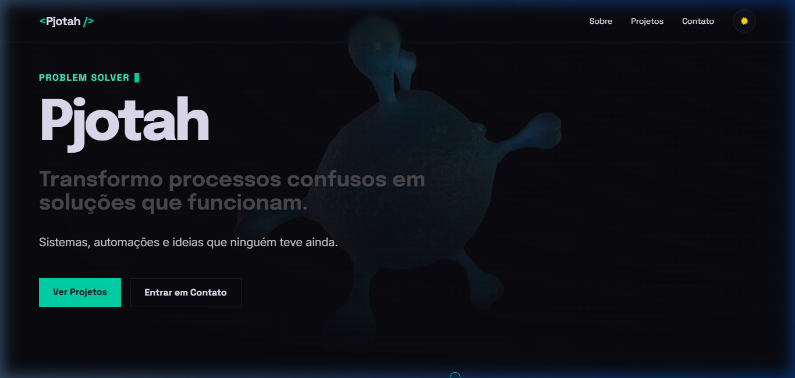
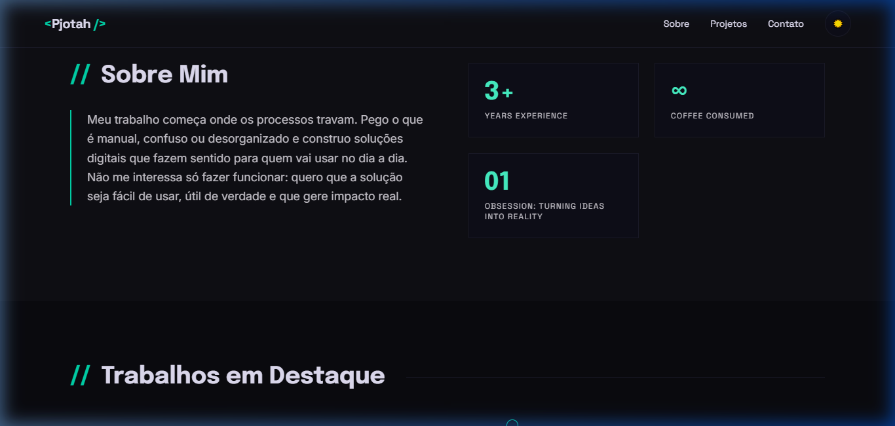
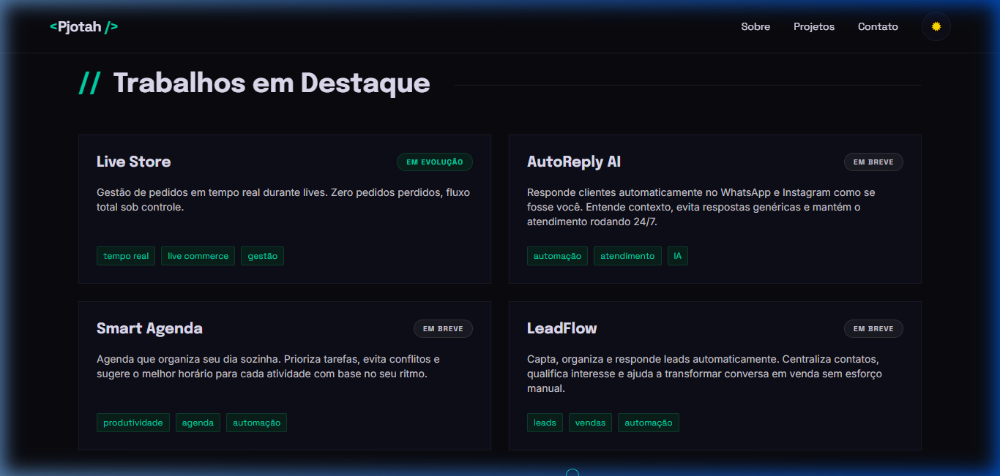
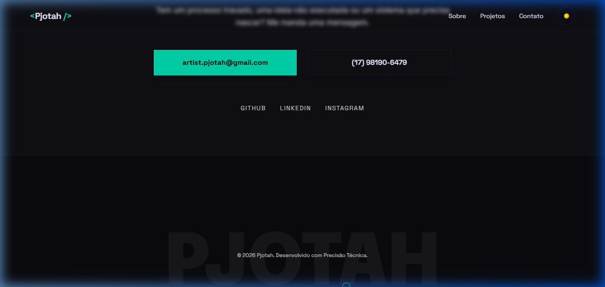

<div align="center">

# `<Pjotah />`

### Problem Solver · Desenvolvedor · Criador de Sistemas

**Transformo processos confusos em soluções que funcionam.**  
Sistemas, automações e ideias que ninguém teve ainda.

[](https://pjotah.vercel.app)
[](https://www.linkedin.com/in/pjotah/)
[](https://www.instagram.com/pjotah/)
[](https://github.com/pjotaaa)

</div>

---

## 📸 Preview

### Hero — A primeira impressão



> Animação 3D imersiva com efeito `mix-blend-difference` que inverte as cores de acordo com o tema (teal no dark mode, rosa vibrante no light mode). Easter egg: clique no vírus para uma aceleração surpresa.

---

### Sobre Mim



> Apresentação direta com estatísticas que traduzem experiência real: mais de 3 anos construindo soluções, obsessão com transformar ideias em produto.

---

### Trabalhos em Destaque



> Cards dos projetos em desenvolvimento: **Live Store**, **AutoReply AI**, **Smart Agenda** e **LeadFlow** — cada um resolve um problema real de negócios.

---

### Contato


> Botões diretos e sem fricção para e-mail e WhatsApp, além dos links para todas as redes sociais.

---

### Footer



> Marca d'água tipográfica que ocupa o rodapé com a assinatura visual do projeto.

---

## 🛠️ Tech Stack

| Categoria | Tecnologia |
|-----------|-----------|
| **Framework** | React + Vite |
| **Estilização** | Tailwind CSS |
| **Animações** | Framer Motion |
| **Tipografia** | Epilogue · Inter · Space Grotesk |
| **Deploy** | Vercel (CI/CD automático via GitHub) |

---

## ✨ Features

- 🎬 **Background animado** — Vídeo 3D com `mix-blend-difference` para integração perfeita com o tema
- 🌗 **Modo claro/escuro** — Sistema de temas via variáveis CSS, com paleta rosa no light e teal no dark
- 🐣 **Easter Egg** — Clique no vírus para uma aceleração surpresa na animação
- 📱 **100% Responsivo** — Menu hambúrguer no mobile, layout adaptativo em todas as telas
- ⚡ **Performance** — Vídeo em loop nativo, animações delegadas ao Framer Motion
- 🔍 **SEO & Open Graph** — Meta tags completas para compartilhamento profissional em redes sociais

---

## 🚀 Rodando localmente

```bash
# Clone o repositório
git clone https://github.com/pjotaaa/portifolio-pjotah.git

# Instale as dependências
npm install

# Rode o servidor de desenvolvimento
npm run dev
```

Abra [http://localhost:5173](http://localhost:5173) no seu navegador.

---

## 📦 Build para produção

```bash
npm run build
```

---

<div align="center">

Feito com precisão técnica por **Pjotah** · 2026

</div>
